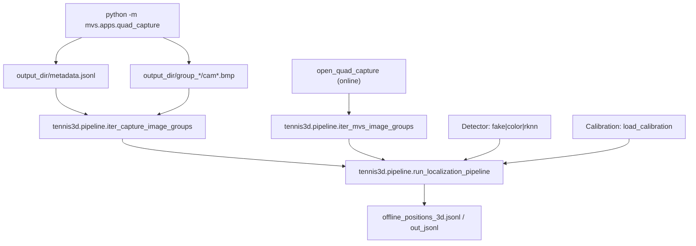

# 架构与数据流（mvs + tennis3d）

本文档聚焦“模块职责、调用关系、输入输出”，以便你快速定位入口并理解 online/offline 的数据流。

## 一句话架构

- `mvs` 负责采集与同步组包（硬件保证同曝光，软件负责正确配对与落盘）。
- `tennis3d` 负责检测与几何（检测 bbox → 取中心点 → 多视角三角化 → 评估重投影误差 → 输出 3D）。

## 入口与调用关系

### 采集与诊断（mvs）

- 采集主入口：`python -m mvs.apps.quad_capture`
  - 调用：`mvs.load_mvs_binding()` → `mvs.pipeline.open_quad_capture()` → `mvs.capture_session.run_capture_session()`
  - 输出：
    - 图片（可选）：`--save-mode sdk-bmp|raw|none`
    - 元数据：`<output_dir>/metadata.jsonl`

- 采集分析：`python -m mvs.apps.analyze_capture_run`
  - 输入：`<output_dir>/metadata.jsonl`
  - 输出：报告文本（stdout）+ 可选 JSON 汇总 `--write-json`

- 按相机重排：`tools/mvs_relayout_by_camera.py`
  - 输入：包含 `metadata.jsonl` 的 captures 目录
  - 输出：`<captures_dir>_by_camera/`（`cam{i}_{serial}/...`）

### 网球 3D 定位（tennis3d）

- 在线定位：`python -m tennis3d.apps.online_mvs_localize`
  - 调用链：
    - `mvs.pipeline.open_quad_capture()` 打开相机与组包
    - `tennis3d.pipeline.iter_mvs_image_groups()` 把 `FramePacket` 转为 OpenCV BGR 图
    - `tennis3d.detectors.create_detector()` 选择 fake/color/rknn
    - `tennis3d.pipeline.run_localization_pipeline()`：detect → `tennis3d.localization.localize_balls()` → 输出 JSONL

- 离线定位（从 captures）：`python -m tennis3d.apps.offline_localize_from_captures`
  - 调用链：
    - `tennis3d.pipeline.iter_capture_image_groups()` 读取 `captures_dir/metadata.jsonl` + 图片
    - 后续与在线相同：detector → run_localization_pipeline

- 三相机离线检测（时间对齐 + 推理）：`python -m tennis3d.apps.offline_detect`
  - 调用：`tennis3d.offline_detect.pipeline.run_pipeline()`
  - 输出：`data/tools_output/tennis_detections.json`（可选 CSV/可视化）

- 仅几何三角化（已有 detections.json）：`tools/tennis_localize_from_detections.py`
  - 输入：检测结果 JSON + 标定文件
  - 输出：`data/tools_output/tennis_positions_3d.json`（可配）

## 数据流图



## 关键输入/输出格式

### 1) captures：`metadata.jsonl`

`python -m mvs.apps.quad_capture` 在 `output_dir/metadata.jsonl` 中混合写入两类记录：

- 事件记录：`{"type": "camera_event", ...}`、`{"type": "soft_trigger_send", ...}`
- 组记录：包含 `frames` 字段（`tennis3d.pipeline.iter_capture_image_groups()` 会自动跳过事件记录）

典型组记录结构（字段会更多，这里只列关键）：

```json
{
  "group_seq": 0,
  "group_by": "frame_num",
  "trigger_index": 0,
  "frames": [
    {
      "cam_index": 0,
      "serial": "DA8199303",
      "frame_num": 1,
      "dev_timestamp": 123,
      "lost_packet": 0,
      "file": "data\\captures_master_slave\\...\\cam0_seq000000_f1.bmp"
    }
  ]
}
```

注意：
- `file` 可能是相对路径；离线读取会用 `captures_dir` 进行补全。
- 分组键 `group_by` 推荐以采集时选择为准：`trigger_index|frame_num|sequence`。

### 2) 标定文件（JSON/YAML）

`tennis3d.geometry.calibration.load_calibration()` 支持 `.json/.yaml/.yml`。
外参约定为 world→camera：

$$X_c = R_{wc} X_w + t_{wc}$$

投影矩阵：

$$P = K [R_{wc} | t_{wc}]$$

关键点：标定中 `cameras` 的 key 必须与 pipeline 使用的“相机名”一致。
- 在线/离线（captures）模式下，默认相机名为 **serial 字符串**（见 `tennis3d.pipeline.sources`）。
- 如果你的标定用 cam0/cam1 命名，会导致相机被跳过（见改进建议）。

### 3) 3D 输出（JSONL）

在线/离线定位输出为 JSON Lines：**每个同步组输出一行记录**（即使没有球也会输出 `balls: []`），便于调试与后处理。

顶层关键字段：

- `balls`: list[dict]，长度为 0..N

每个 `ball` 元素包含（字段均可 JSON 序列化）：

- `ball_id`: 组内编号（从 0 开始）
- `ball_3d_world`: 世界坐标系 3D 点 `[x,y,z]`
- `ball_3d_camera`: `{camera_name: [x,y,z]}`（仅包含参与该球定位的视角）
- `used_cameras`: `[camera_name, ...]`（该球实际使用的相机列表）
- `reprojection_errors`: 每相机重投影误差（像素），包含 `uv/uv_hat/error_px`
- `detections`: `{camera_name: {bbox, score, cls, center}}`（可选，受 `include_detection_details` 控制）
- `quality`: 质量评分（视角数越多/误差越小越高），用于排序与冲突消解
- `num_views`、`median_reproj_error_px`、`max_reproj_error_px`: 便于快速筛选与调参

